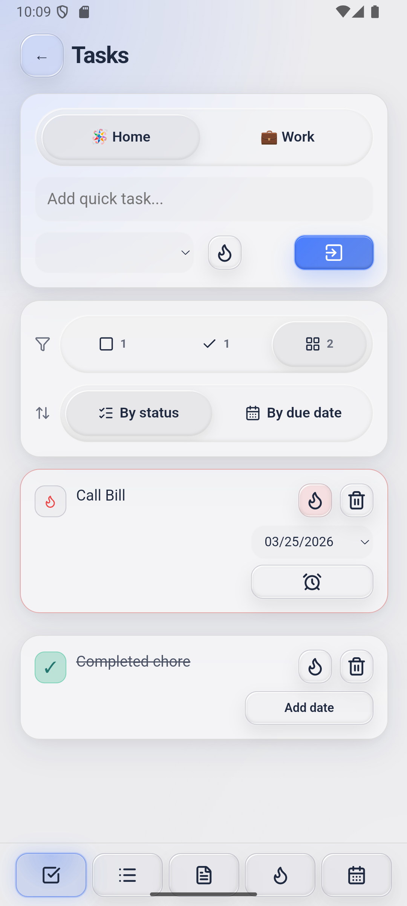
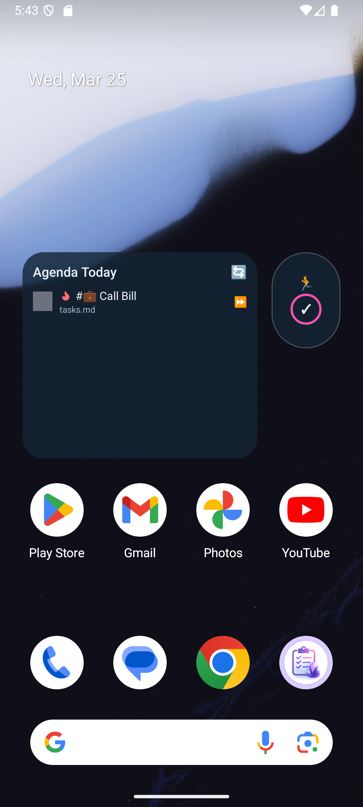

# Quick Capture

Quick Capture started as a vibe-coded side project — I wanted a faster way to jot down notes and tasks on mobile without waiting ~10 seconds for Obsidian to open.

It’s now a lightweight companion app that lets you quickly capture thoughts, tasks, and lists, while keeping everything in plain Markdown files.

## Why it exists
Speed → open → type → done
No lock-in → everything is just .md files
Works with your setup → Obsidian, VS Code, Git, Syncthing, etc.

It’s not trying to replace your system — just make capturing into it easier.

---
## How it works

Pick a folder (your “vault”), and the app writes everything there as Markdown.

That’s it.

No database, no cloud, no magic.

## Tasks

Tasks use simple Markdown syntax:

- [ ] Open task
- [x] Done task
- [-] Cancelled task
- [f] Important task 🔥

Add a due date with:

📅 2026-03-28

When entering a time, a *notification* will be set on your phone.

## Notes & Lists
Notes = .md files
Lists = structured markdown with simple tracking
Everything editable outside the app

[Image: Screenshot of the note-taking view, showing a note being edited with Markdown syntax.](images/NoteViewDark.png)

## Views
Agenda → what’s due today
Tasks → everything in one place
Notes → browse files
Habits → simple tracking

[Image: Screenshot of the Agenda view, showing today's tasks with priority icons.](images/AgendaViewDark.png)

## Widget

Quick glance at today’s tasks without opening the app.

## Setup
Install the app
Pick a folder
Start typing

Optional: connect it to Syncthing / Git / whatever you already use.

## What this is (and isn’t)

Is:

- Fast capture tool
- Markdown-first
- Built for people who already have a system

Isn’t:

- A full productivity suite
- A replacement for Obsidian
- Cloud-based

[Settings](images/SettingsSystemLight.png)
[Habits](images/HabitsSystemLight.png)

