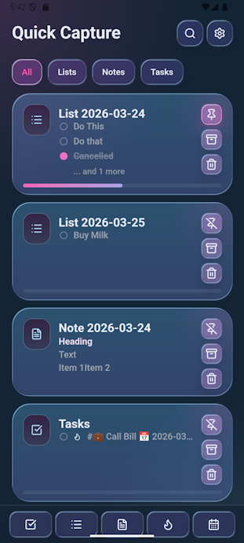

# Quick Capture

Quick Capture is a simple yet powerful application designed to help you quickly jot down and organize your thoughts, tasks, and notes. It's built for those who appreciate simplicity, data ownership, and the power of plain text.

## Core Philosophy: Your Data is Yours

The central principle of Quick Capture is that you should always have full control over your data. Instead of locking your information in a proprietary format or a cloud service, Quick Capture stores everything as plain text Markdown files in a folder you choose on your device.

This approach means:
- **Data Ownership**: Your files are yours. You can back them up, sync them with your own service (like Syncthing, Dropbox, or Git), or move them to another device at any time.
- **Interoperability**: You can open and edit your notes and tasks with any text editor, from a simple one like Notepad to powerful ones like VS Code or Obsidian.
- **Longevity**: Plain text is future-proof. Your data will be readable decades from now, long after specific apps have come and gone.
- **Privacy**: Your data stays on your device unless you decide to sync it elsewhere.

## How it Works

When you first start Quick Capture, it will ask you to pick a folder on your device. This folder will become your "vault" where all your notes, tasks, and other information will be stored.

### Notes

- **Creating Notes**: You can create a new note on any topic. Each note is saved as a separate `.md` file in your chosen folder.
- **Markdown Formatting**: You can use standard Markdown syntax to format your notes, creating headers, lists, bold/italic text, and more.

[Image: Screenshot of the note-taking view, showing a note being edited with Markdown syntax.](images/NoteViewDark.png)

### Task Management

Quick Capture has a robust, text-based task management system.

- **Task Syntax**: Tasks are stored within your `.md` files using a simple, readable syntax.
  - ` - [ ] An open task`
  - ` - [x] A completed task`
  - ` - [-] A cancelled task`
- **Due Dates**: Add a due date to any task using the calendar emoji (`📅`) followed by the date in `YYYY-MM-DD` format.
  - ` - [ ] Finalize report 📅 2026-03-28`
- **Priorities**: Mark a task as high-priority by adding an `f` inside the brackets. In the app, these tasks are highlighted with a flame icon to draw your attention.
  - ` - [f] Urgent: Fix the login bug! 📅 2026-03-25`

### Views

The app provides several ways to look at your data:

- **Agenda View**: Shows you all tasks that are due today, helping you focus on what's important right now.
- **Tasks View**: A comprehensive view of all your tasks from all your files.
- **Notes View**: A list of all your notes for easy browsing and opening.
- **Habits View**: A dedicated space for tracking recurring habits.

[Image: Screenshot of the Agenda view, showing today's tasks with priority icons.](images/AgendaViewDark.png)

### Android Home Screen Widget

Stay on top of your day without even opening the app. Quick Capture provides a home screen widget that displays your tasks due today, keeping your agenda just a glance away.

[Image: Screenshot of the Android home screen widget.](images/WidgetSpark.png)

## Getting Started

1.  Download and install the app.
2.  Open it and grant permission to access your file system.
3.  Choose or create a folder where you want to store your data.
4.  Set up your theme, quick tasks, and habits
[Settings](images/SettingsSystemLight.png)
[Habits](images/HabitsSystemLight.png)

