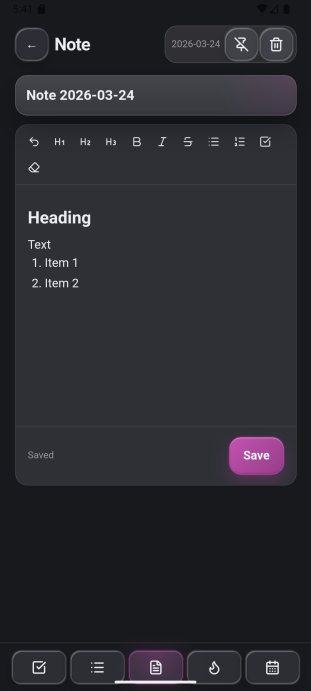
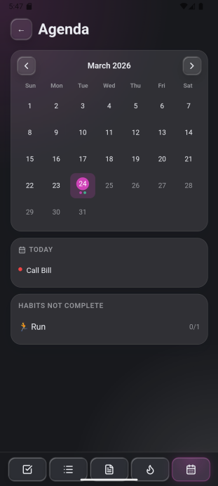
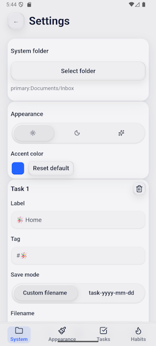
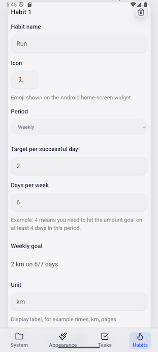

# Quick Capture

Quick Capture started as a side project. I wanted a faster way to jot down notes and tasks on mobile without waiting for a larger app to open.

It is a lightweight companion app for capturing thoughts, tasks, lists, and habits while keeping everything in plain Markdown files.


## Why it exists
Speed -> open -> type -> done
No lock-in -> everything is just `.md` files
Works with your setup -> Obsidian, VS Code, Git, Syncthing, etc.

It is not trying to replace your system, just make capture into it easier.

---
## How it works

Pick a folder (I use an 'Inbox' folder from my vault) and the app writes everything there as Markdown.

That is it.

No database, no cloud, no magic.

## Tasks

Tasks use simple Markdown syntax:

- [ ] Open task
- [x] Done task
- [-] Cancelled task
- [f] Important task

Add a due date with:

`2026-03-28`

When entering a time, a notification will be set on your phone.


## Notes & Lists
Notes = `.md` files
Lists = structured markdown with simple tracking
Everything editable outside the app



## Views
Agenda -> what is due today
Tasks -> everything in one place
Notes -> browse files
Habits -> simple tracking



## Habits

Habits live in Markdown files under `habits/`.

The app supports:

- daily, weekly, and monthly habits
- target counts and scheduled days
- skip and fail states
- a simple history heatmap

Progress is stored in monthly files under `habit-logs/`.

## Widgets

Android widgets can show:

- a single habit with quick toggling
- today's agenda

Widgets refresh when app data changes and when the day rolls over.


## Setup
Install the app
Pick a folder
Start typing

Optional: connect it to Syncthing, Git, or whatever you already use.

## Dev

Build the web app:

```bash
npm run build
```

Sync the Android project:

```bash
npx cap sync android
```

Then open `android/` in Android Studio and build a signed APK there.

## What this is (and isn't)

Is:

- Fast capture tool
- Markdown-first
- Built for people who already have a system

Isn't:

- A full productivity suite
- A replacement for Obsidian
- Cloud-based



